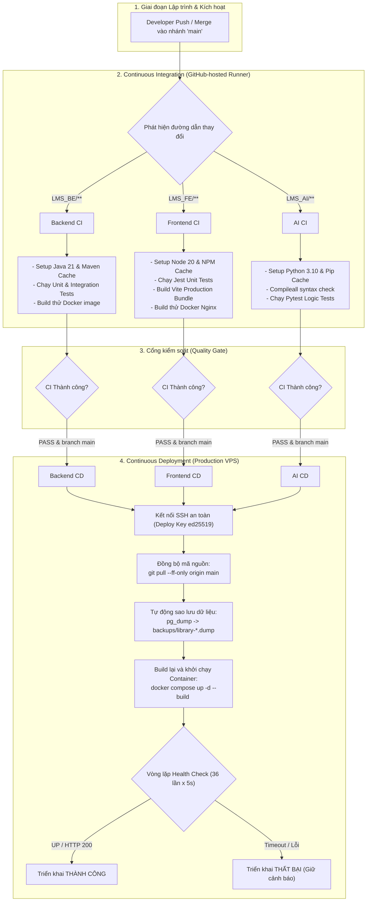

# Tài Liệu Thiết Kế Và Luồng Hoạt Động CI/CD (LMS Library74)

Tài liệu này mô tả chi tiết kiến trúc, luồng hoạt động, cơ chế an toàn và giải pháp kỹ thuật của hệ thống Tích hợp liên tục và Triển khai liên tục (**CI/CD - Continuous Integration / Continuous Deployment**) cho dự án **LMS Library74**.

---

## 1. Tổng Quan & Mục Tiêu Thiết Kế

### 1.1. Đặt vấn đề
Trước khi thiết lập CI/CD, quy trình triển khai phần mềm gặp các hạn chế:
- **Triển khai thủ công (Manual Deployment)**: Lập trình viên phải SSH vào VPS, gõ lệnh kéo code và build container. Dễ phát sinh sai sót thao tác (human error).
- **Rủi ro mã nguồn lỗi lọt lên Production**: Code chưa qua kiểm thử tự động có thể làm sập hệ thống hoặc gây lỗi logic khi đến tay người dùng cuối.
- **Rủi ro mất an toàn dữ liệu**: Cập nhật backend hoặc migration database mà không có bản sao lưu tức thì trước thời điểm deploy.

### 1.2. Mục tiêu đạt được sau khi áp dụng CI/CD
1. **Tự động hóa 100%**: Từ thời điểm commit code được push/merge vào nhánh `main`, toàn bộ quá trình kiểm thử, build và triển khai lên máy chủ diễn ra tự động.
2. **Kiến trúc Monorepo phân tách theo module (Path-filtered Pipeline)**: Thay đổi ở module nào (`LMS_BE`, `LMS_FE`, `LMS_AI`) chỉ kích hoạt CI/CD của riêng module đó, tiết kiệm thời gian và tài nguyên máy chủ.
3. **An toàn dữ liệu tuyệt đối (Zero Data Loss)**: Luôn tự động tạo bản chụp Database Dump trước khi bất kỳ phiên bản backend mới nào được áp dụng.
4. **Kiểm tra trạng thái sau triển khai (Post-deployment Health Check)**: Kiểm chứng dịch vụ đã thực sự sẵn sàng phục vụ trước khi đánh dấu pipeline hoàn tất.

---

## 2. Sơ Đồ Kiến Trúc Luồng Hoạt Động (Architecture Flow)



---

## 3. Chi Tiết Các Giai Đoạn Trong Pipeline

### 3.1. Giai đoạn CI (Continuous Integration)

CI thực thi trên máy ảo Ubuntu độc lập do GitHub cung cấp (**GitHub-hosted Runner**).

| Thành phần | File Workflow | Nhiệm vụ chính | Thời gian thực thi |
| :--- | :--- | :--- | :--- |
| **Backend CI** | `.github/workflows/backend-ci.yml` | - Thiết lập JDK 21 Temurin kèm cache Maven repository.<br>- Chạy toàn bộ test suites (`mvn test`).<br>- Build thử nghiệm Docker Image backend để xác thực Dockerfile. | ~1 - 2 phút |
| **Frontend CI** | `.github/workflows/frontend-ci.yml` | - Thiết lập Node.js 20 kèm cache NPM.<br>- Cài đặt sạch dependencies (`npm ci`).<br>- Chạy unit test giao diện với Jest (`npm test`).<br>- Biên dịch static bundle bằng Vite (`npm run build`).<br>- Build thử nghiệm Docker Image Nginx. | ~1 - 2 phút |
| **AI Service CI** | `.github/workflows/ai-ci.yml` | - Thiết lập Python 3.10 kèm cache Pip wheel.<br>- Cài đặt requirements.<br>- Biên dịch kiểm tra cú pháp toàn diện (`python -m compileall`).<br>- Chạy bộ test hồi quy với Pytest (`pytest -q`). | ~1 - 2 phút |

> **Quyết định tối ưu hóa đặc biệt cho AI CI**:
> Ban đầu, AI CI có bước build Docker image. Tuy nhiên, thư viện AI có `torch` (~1GB), `sentence-transformers`, `scipy` rất nặng. Việc build Docker trên GitHub Runner tải lại PyTorch không có cache làm CI kéo dài đến 15 phút và tốn quota miễn phí. 
> **Giải pháp**: Loại bỏ bước `docker build` trong AI CI, chỉ tập trung kiểm thử cú pháp và logic. Việc đóng gói image được chuyển giao hoàn toàn cho VPS khi CD chạy (nơi Docker đã có sẵn layer cache cục bộ của PyTorch chỉ mất 3-5 giây).

---

### 3.2. Giai đoạn CD (Continuous Deployment)

CD được kích hoạt tự động theo sự kiện `workflow_run` (chỉ khi CI tương ứng đạt trạng thái `success` trên nhánh `main`) hoặc kích hoạt chủ động qua `workflow_dispatch`.

#### Các bước thực thi trên máy chủ Production:

1. **Xác thực danh tính máy chủ & Khóa truy cập (Zero Password)**:
   - Sử dụng Private Key chuẩn `ed25519` được mã hóa trong GitHub Secrets (`DEPLOY_SSH_KEY`).
   - Kiểm tra vân tay máy chủ qua `DEPLOY_KNOWN_HOSTS` nhằm ngăn chặn tấn công giả mạo (Man-in-the-Middle).
2. **Đồng bộ mã nguồn an toàn**:
   ```bash
   cd /opt/library74
   git pull --ff-only origin main
   ```
   Tùy chọn `--ff-only` đảm bảo máy chủ không bị xung đột merge commit bất thường trên môi trường chạy thật.
3. **Kiểm tra tính hợp lệ của cấu hình**:
   ```bash
   docker compose --env-file .env.prod -f docker-compose.prod.yml config >/dev/null
   ```
4. **Bảo vệ dữ liệu tự động (Pre-deployment Database Snapshot)**:
   Đối với Backend CD, hệ thống tự động gọi service sao lưu:
   ```bash
   docker compose --env-file .env.prod -f docker-compose.prod.yml --profile backup run --rm postgres-backup
   ```
   Tạo ra file dump định dạng nén nhị phân `library-YYYYMMDD-HHMMSS.dump` trong thư mục `backups/`.
5. **Cập nhật dịch vụ độc lập (Zero Interruption)**:
   Chỉ cập nhật đúng container cần thiết, các hạ tầng Database, Cache, Message Queue, Reverse Proxy vẫn duy trì liên tục:
   - Backend: `docker compose ... up -d --build backend`
   - AI: `docker compose ... up -d --build ai-api ai-worker`
   - Frontend: `docker compose ... up -d --build frontend`
6. **Kiểm tra sức khỏe dịch vụ (Post-deployment Health Check)**:
   Hệ thống thực hiện vòng lặp thăm dò trạng thái (polling) trong tối đa 3 phút (36 lần, mỗi lần cách nhau 5 giây):
   - **Backend**: Truy vấn actuator endpoint nội bộ:
     ```bash
     docker compose exec -T backend wget -qO- http://127.0.0.1:8080/actuator/health | grep -q UP
     ```
   - **AI Service**: Truy vấn FastAPI endpoint nội bộ:
     ```bash
     docker compose exec -T ai-api curl -fsS http://127.0.0.1:8001/health
     ```
   - **Frontend**: Kiểm tra đồng thời container nội bộ và cổng proxy công khai:
     ```bash
     docker compose exec -T frontend wget -qO- http://127.0.0.1/ >/dev/null && curl -fsS https://library74.uk/ >/dev/null
     ```

---

## 4. Quản Lý Bảo Mật & GitHub Secrets

Để bảo vệ hạ tầng máy chủ, toàn bộ thông tin nhạy cảm được quản lý phân tách:
- **Biến môi trường nghiệp vụ** (`.env.prod`): Được lưu trữ trực tiếp trên VPS với phân quyền nghiêm ngặt `chmod 600`, không đưa lên Git.
- **Biến môi trường triển khai** (GitHub Repository Secrets):
  - `DEPLOY_HOST`: Địa chỉ IP/Domain máy chủ (`library74.uk` / `34.21.196.118`).
  - `DEPLOY_PORT`: Cổng SSH quản trị (`22`).
  - `DEPLOY_USER`: User thực thi có quyền quản lý Docker (`root` hoặc `hosythang`).
  - `DEPLOY_PATH`: Đường dẫn thư mục dự án trên máy chủ (`/opt/library74`).
  - `DEPLOY_SSH_KEY`: Khóa riêng tư SSH (`ed25519`) dành riêng cho CI/CD.
  - `DEPLOY_KNOWN_HOSTS`: Chuỗi nhận dạng public key máy chủ để xác thực đường truyền.

---

## 5. Những Bài Toán Kỹ Thuật Đã Xử Lý Khi Triển Khai

Trong quá trình xây dựng hệ thống CI/CD cho dự án, một số vấn đề kỹ thuật chuyên sâu đã được phát hiện và giải quyết:

### 5.1. Xử lý lệch múi giờ (Timezone Mismatch) trong Unit Test Backend
- **Hiện tượng**: Test `ReturnBookUseCaseTest.returnSuccess_withOverdueFine_3Days` bị fail trên GitHub Actions với kết quả: `expected: 3000 but was: 4000`.
- **Nguyên nhân**:
  - Code nghiệp vụ tính ngày quá hạn dựa vào `LocalDate.now(ZoneId.of("Asia/Ho_Chi_Minh"))` (GMT+7).
  - File test lại dùng `LocalDate.now()` theo giờ mặc định của máy chủ.
  - GitHub Actions Runner chạy theo giờ UTC (GMT+0). Khi test chạy vào ban đêm ở Việt Nam (ví dụ 18:04 UTC = 01:04 sáng hôm sau ở VN), giờ UTC vẫn ở ngày cũ còn giờ Việt Nam đã sang ngày mới $\rightarrow$ số ngày trễ bị lệch thành 4 ngày thay vì 3 ngày.
- **Giải pháp**: Cố định `ZoneId.of("Asia/Ho_Chi_Minh")` vào cả file unit test, đảm bảo tính toán thời gian luôn đồng nhất bất kể test chạy ở đâu hay vào khung giờ nào.

### 5.2. Chuẩn hóa lệnh tương tác Container trong Docker Compose
- **Hiện tượng**: Ban đầu file CD dùng lệnh `docker exec lms_backend` hoặc `docker exec lms_ai_api`. Khi triển khai qua Docker Compose, container thực tế được đặt tên có tiền tố và hậu tố theo dự án (ví dụ `library74-backend-1`). Lệnh `docker exec` bị lỗi do không tìm thấy container.
- **Giải pháp**: Sử dụng cú pháp chính quy của Compose:
  `docker compose --env-file .env.prod -f docker-compose.prod.yml exec -T <service_name> <command>`.
  Giải pháp này giúp lệnh kiểm tra độc lập hoàn toàn với quy tắc đặt tên container của Docker daemon.

### 5.3. Xung đột phân giải địa chỉ Loopback (IPv6 vs IPv4)
- **Hiện tượng**: Kiểm tra container Nginx qua `http://localhost/` trên Alpine Linux bị từ chối kết nối (`Connection refused`).
- **Nguyên nhân**: Alpine phân giải `localhost` ưu tiên sang địa chỉ IPv6 `::1`, trong khi Nginx cấu hình chỉ lắng nghe trên giao thức IPv4 `0.0.0.0:80`.
- **Giải pháp**: Trỏ rõ ràng vào địa chỉ IPv4 loopback `http://127.0.0.1/` trong script kiểm tra sức khỏe.

---

## 6. Đánh Giá Hiệu Quả Của Hệ Thống

| Tiêu chí | Trước khi có CI/CD | Sau khi có CI/CD |
| :--- | :--- | :--- |
| **Thời gian triển khai** | 15 – 30 phút (thao tác tay) | **Dưới 3 phút** (hoàn toàn tự động) |
| **Xác thực chất lượng code** | Phụ thuộc sự cẩn thận của dev | **100% tự động chạy test trước khi deploy** |
| **Sao lưu cơ sở dữ liệu** | Thủ công (dễ bị quên) | **Tự động 100% trước mỗi lần deploy Backend** |
| **Mức độ gián đoạn dịch vụ** | Thường mất kết nối khi build | **Tối thiểu hóa downtime nhờ cập nhật theo container** |
| **Phát hiện lỗi phát hành** | Phải tự mở web kiểm tra | **Hệ thống Polling Health Check tự động xác nhận** |
